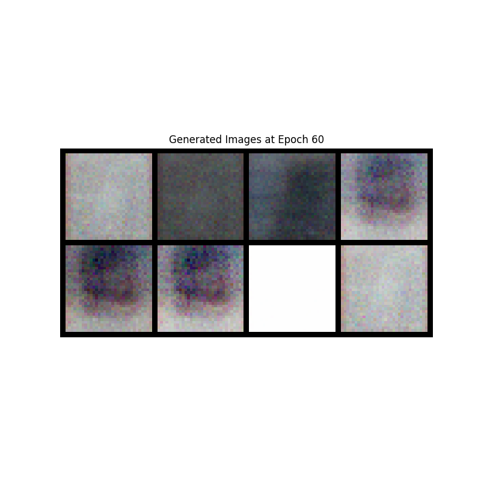
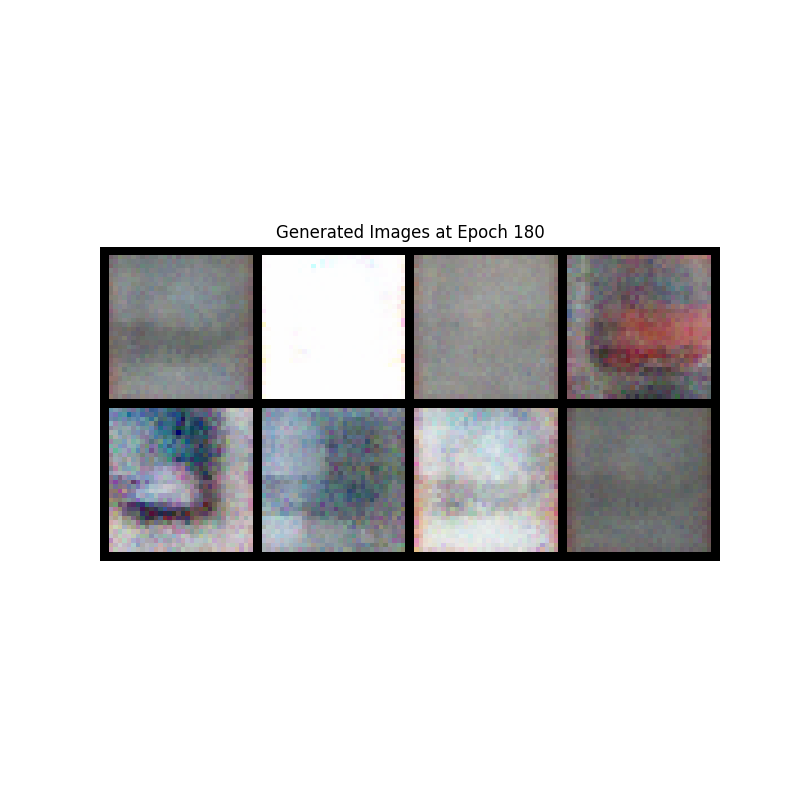
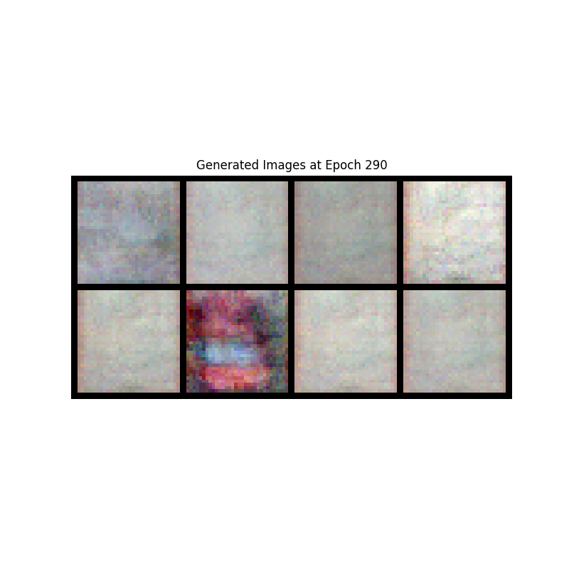
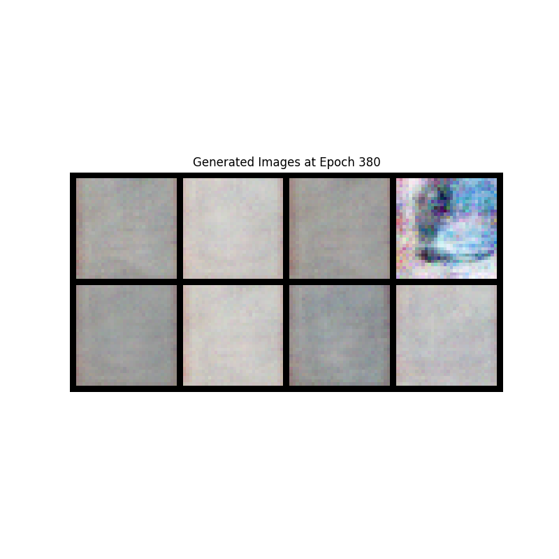
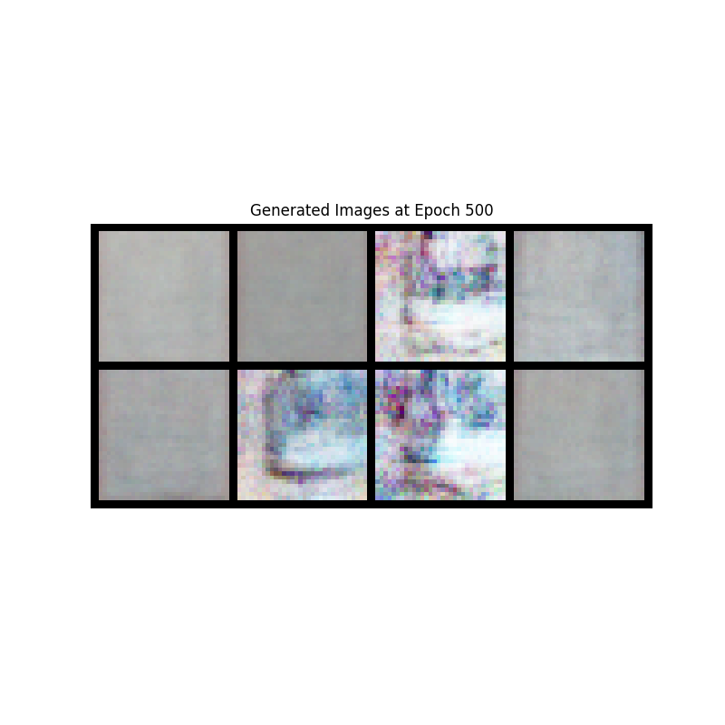
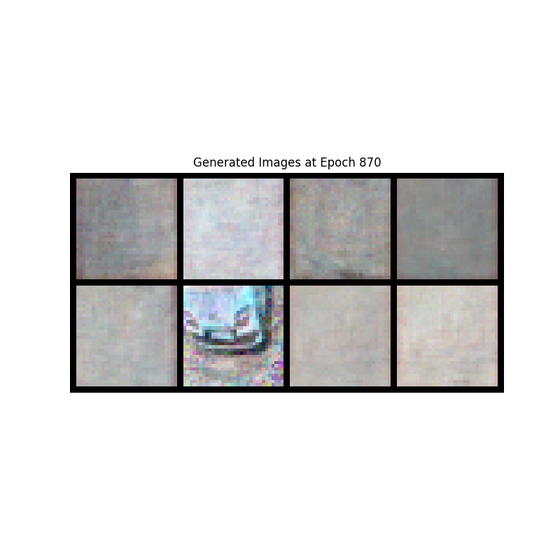
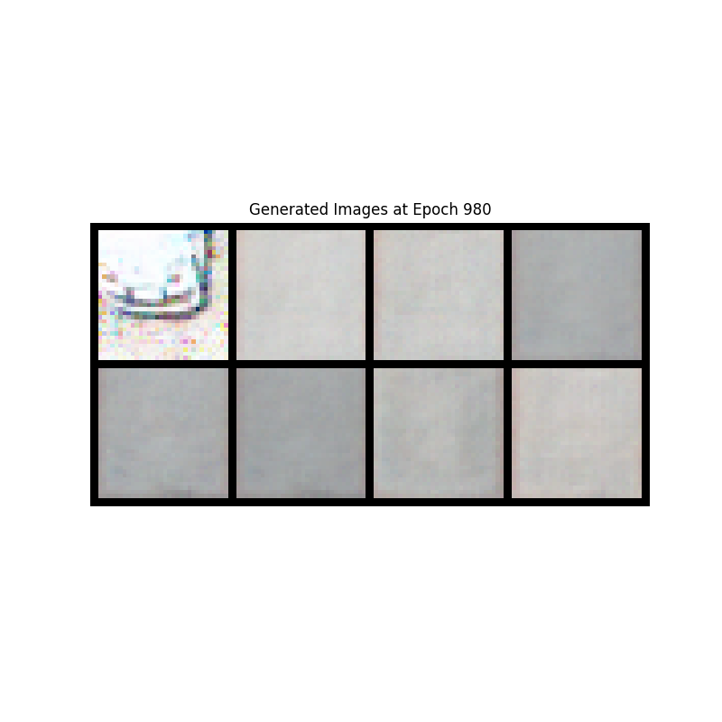

# GAN
Bellow is the simplified GAN implementation (Discriminator and Generator). This file can found in `/gan.py`
```python
class Generator(nn.Module):
    def __init__(self, z_dim=100):
        super(Generator, self).__init__()
        self.fc = nn.Sequential(
            nn.Linear(z_dim, 256),
            nn.ReLU(True),
            nn.Linear(256, 512),
            nn.ReLU(True),
            nn.Linear(512, 1024),
            nn.ReLU(True),
            nn.Linear(1024, 3*32*32),  # Assuming RGB images of 32x32
            nn.Tanh()  # Output range [-1, 1]
        )
    
    def forward(self, z):
        return self.fc(z).view(-1, 3, 32, 32)


class Discriminator(nn.Module):
    def __init__(self):
        super(Discriminator, self).__init__()
        self.fc = nn.Sequential(
            nn.Linear(3*32*32, 1024),
            nn.LeakyReLU(0.2, inplace=True),
            nn.Linear(1024, 512),
            nn.LeakyReLU(0.2, inplace=True),
            nn.Linear(512, 256),
            nn.LeakyReLU(0.2, inplace=True),
            nn.Linear(256, 1),
            nn.Sigmoid()  # Output range [0, 1] for probability
        )
    
    def forward(self, x):
        return self.fc(x.view(x.size(0), -1))  # Flatten image
```

Training process is bit longer and is defined in `gan_train.py`. Gan was trained over 100, 500, and 1000 epochs.
Longer the training, better the results. After aprox. 300 epochs, pictures slightly resembling cars can be seen.
Images bellow are **randomly selected** and consist of **both free and full parking spaces**.









## Result
After using the GAN dataset with googlenet and without the google net:
- GAN enabled: 90.84821428571428
- Gan disabled: 98.88392857142857
The score is worse using the augmented dataset. I've noticed images of free spaces being generated 
more than images of cars. Not sure why.
