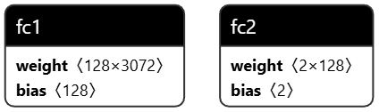
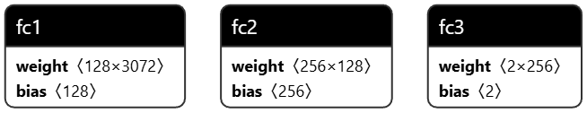
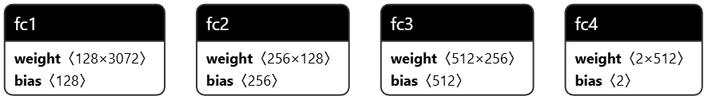
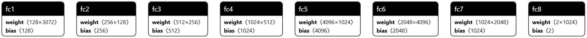

# NNs in Pytorch

I've created four simple neural networks in Pytorch composed from linear layers. 

## Models
Bellow are the descriptions and the results from the test. All the models were train using the following settings:
```python
loss = nn.CrossEntropyLoss()
optim = optim.Adam(model.parameters(), lr=0.001)
epochs = 10
```

### ParkingSpaceModelS
Average score: **88.61607142857143**


```python
class ParkingSpaceModelS(nn.Module):
    def __init__(self):
        super(ParkingSpaceModelS, self).__init__()
        self.fc1 = nn.Linear(32 * 32 * 3, 128)
        self.fc2 = nn.Linear(128, 2)

    def forward(self, x):
        x = x.view(-1, 32 * 32 * 3)
        x = torch.relu(self.fc1(x))
        x = self.fc2(x)
        return x
```

### ParkingSpaceModelM
Average score: **84.44940476190474**


```python
class ParkingSpaceModelM(nn.Module):
    def __init__(self):
        super(ParkingSpaceModelM, self).__init__()
        self.fc1 = nn.Linear(32 * 32 * 3, 128)
        self.fc2 = nn.Linear(128, 256)
        self.fc3 = nn.Linear(256, 2)

    def forward(self, x):
        x = x.view(-1, 32 * 32 * 3)
        x = torch.relu(self.fc1(x))
        x = torch.relu(self.fc2(x))
        x = self.fc3(x)
        return x
```


### ParkingSpaceModelL
Average score: **84.15178571428571**


```python
class ParkingSpaceModelL(nn.Module):
    def __init__(self):
        super(ParkingSpaceModelL, self).__init__()
        self.fc1 = nn.Linear(32 * 32 * 3, 128)
        self.fc2 = nn.Linear(128, 256)
        self.fc3 = nn.Linear(256, 512)
        self.fc4 = nn.Linear(512, 2)

    def forward(self, x):
        x = x.view(-1, 32 * 32 * 3)
        x = torch.relu(self.fc1(x))
        x = torch.relu(self.fc2(x))
        x = torch.relu(self.fc3(x))
        x = self.fc4(x)
        return x
```

### ParkingSpaceModelXL
Average score: **53.49702380952382**


```python
class ParkingSpaceModelXL(nn.Module):
    def __init__(self):
        super(ParkingSpaceModelXL, self).__init__()
        self.fc1 = nn.Linear(32 * 32 * 3, 128)
        self.fc2 = nn.Linear(128, 256)
        self.fc3 = nn.Linear(256, 512)
        self.fc4 = nn.Linear(512, 1024)
        self.fc5 = nn.Linear(1024, 4096)
        self.fc6 = nn.Linear(4096, 2048)
        self.fc7 = nn.Linear(2048, 1024)
        self.fc8 = nn.Linear(1024, 2)

    def forward(self, x):
        x = x.view(-1, 32 * 32 * 3)
        x = torch.relu(self.fc1(x))
        x = torch.relu(self.fc2(x))
        x = torch.relu(self.fc3(x))
        x = torch.relu(self.fc4(x))
        x = torch.relu(self.fc5(x))
        x = torch.relu(self.fc6(x))
        x = torch.relu(self.fc7(x))
        x = self.fc8(x)
        return x
```

## Summary
More layers and **higher number of neutrons in the layers did not improve the score** ever so slightly. In fact, 
the biggest model had worse score than all the smaller ones. The smallest model had the best score. Trained models 
can be found in `models/` directory.